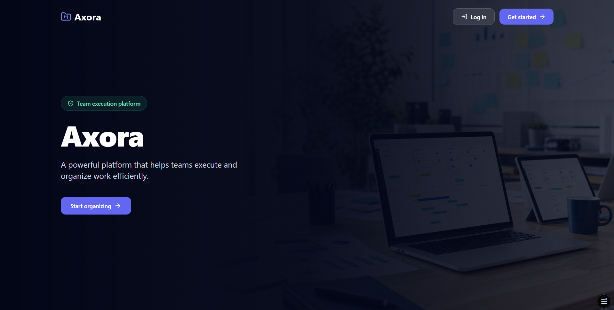
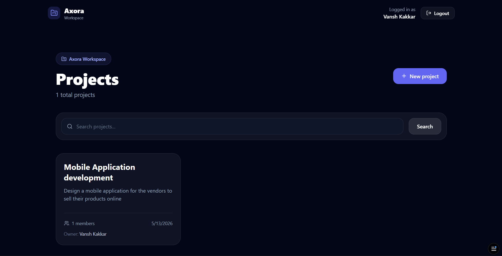
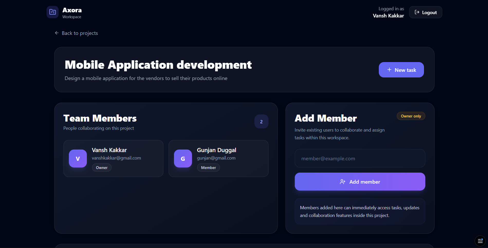

# Axora - MERN Project Management Frontend


## Overview

**Axora** is a modern frontend for a full-stack MERN project management application built as part of an internship interview assignment. The application helps teams organize projects, manage tasks, invite members, assign responsibilities, track task status, and collaborate through a clean dashboard experience.

The frontend is built with **React**, **Vite**, **Tailwind CSS**, **React Router**, and **Axios**, with JWT-based authentication handled through local storage and a centralized auth context.

## Features

- Landing page with branded Axora hero section
- User signup and login flows
- JWT authentication with persistent local storage session
- Protected dashboard routes for authenticated users
- Automatic session validation using `/auth/me`
- Project listing with search and pagination
- Create project workflow using reusable modal form
- Project detail page with team member overview
- Owner-only member invitation by email
- Task creation and editing
- Task deletion with confirmation
- Task status updates directly from the task card
- Task filtering by search, status, priority, and assignee
- Task pagination
- Priority support: `Low`, `Medium`, `High`, `Urgent`
- Status support: `Todo`, `In Progress`, `Done`
- Reusable UI components for layout, modal, forms, pagination, loading states, and error alerts
- Axios interceptor for attaching bearer tokens to API requests
- Dark-first responsive UI using Tailwind CSS
- Icon-driven interface using `lucide-react`
- Form validation and API error rendering
- Toast success notifications for authentication actions

## Tech Stack

| Category | Technology |
| --- | --- |
| Frontend Framework | React 19 |
| Build Tool | Vite |
| Routing | React Router DOM 7 |
| Styling | Tailwind CSS |
| HTTP Client | Axios |
| Icons | Lucide React |
| Notifications | React Toastify |
| State Management | React Context API + Hooks |
| Linting | ESLint |
| Deployment Target | Static frontend hosting such as Vercel, Netlify, or Render |

## Screenshots Section

| Page | Description |
| --- | --- |
| Landing Page | Brand hero section with call-to-action buttons |
| Login Page | Secure authentication screen |
| Signup Page | Account creation screen |
| Projects Dashboard | Searchable, paginated project workspace |
| Project Detail Page | Members, task filters, task cards, and task actions |

Example screenshot layout:

```md



```

Current visual asset used in the landing page:

```md
src/assets/axora-hero.png
```

## Folder Structure

```bash
frontend/
├── public/
│   ├── favicon.svg
│   └── icons.svg
├── src/
│   ├── api/
│   │   └── axios.js
│   ├── assets/
│   │   ├── axora-hero.png
│   │   └── folder-kanban.png
│   ├── components/
│   │   ├── ErrorAlert.jsx
│   │   ├── Layout.jsx
│   │   ├── Loading.jsx
│   │   ├── Modal.jsx
│   │   ├── Pagination.jsx
│   │   ├── ProjectForm.jsx
│   │   └── TaskForm.jsx
│   ├── context/
│   │   └── AuthContext.jsx
│   ├── pages/
│   │   ├── Landing.jsx
│   │   ├── Login.jsx
│   │   ├── ProjectDetail.jsx
│   │   ├── Projects.jsx
│   │   └── Signup.jsx
│   ├── App.jsx
│   ├── brand.js
│   ├── index.css
│   └── main.jsx
├── .gitignore
├── eslint.config.js
├── index.html
├── package.json
├── postcss.config.js
├── tailwind.config.js
└── vite.config.js
```

## Installation & Setup

### 1. Clone the repository

```bash
git clone https://github.com/Vanshkakkar-24/Axora_Frontend
cd frontend
```

### 2. Install dependencies

```bash
npm install
```

### 3. Start the development server

```bash
npm run dev
```

The app will run locally on:

```bash
http://localhost:5173
```

### 4. Build for production

```bash
npm run build
```

### 5. Preview the production build

```bash
npm run preview
```

## Available Scripts

| Script | Description |
| --- | --- |
| `npm run dev` | Starts the Vite development server |
| `npm run build` | Creates an optimized production build |
| `npm run preview` | Serves the production build locally |
| `npm run lint` | Runs ESLint across the project |

## Authentication Flow

Axora implements JWT-based authentication using React Context and local storage.

1. A user signs up or logs in through the auth pages.
2. The frontend sends credentials to the backend auth endpoints.
3. On success, the returned user/session payload is stored in local storage as `userInfo`.
4. Axios reads `userInfo.token` from local storage before each request.
5. The token is attached to protected API calls using the `Authorization` header.
6. On app load, `AuthContext` checks local storage and validates the session through `/auth/me`.
7. If the session is invalid, local storage is cleared and the user is logged out.
8. Protected routes redirect unauthenticated users to `/login`.

Protected route behavior:

```jsx
/projects
/projects/:projectId
```

Unauthenticated users attempting to access protected pages are redirected to:

```bash
/login
```

Logout behavior:

- Removes `userInfo` from local storage
- Clears the authenticated user from context
- Redirects the user to the landing page

## API Integration

API requests are centralized through the Axios instance in:

```bash
src/api/axios.js
```

The Axios instance:

- Defines the backend base URL
- Reads JWT data from local storage
- Adds bearer tokens to request headers
- Is reused across auth, projects, members, and tasks

Main API endpoints used by the frontend:

| Feature | Method | Endpoint |
| --- | --- | --- |
| Login | `POST` | `/auth/login` |
| Signup | `POST` | `/auth/signup` |
| Validate Session | `GET` | `/auth/me` |
| Get Projects | `GET` | `/projects` |
| Create Project | `POST` | `/projects` |
| Get Project Details | `GET` | `/projects/:projectId` |
| Add Project Member | `POST` | `/projects/:projectId/members` |
| Get Project Tasks | `GET` | `/projects/:projectId/tasks` |
| Create Task | `POST` | `/projects/:projectId/tasks` |
| Update Task | `PATCH` | `/tasks/:taskId` |
| Delete Task | `DELETE` | `/tasks/:taskId` |

## Responsive Design Features

The UI is designed with a dark-first, modern dashboard style using Tailwind CSS.

Responsive features include:

- Mobile-friendly landing page navigation
- Flexible authentication cards
- Responsive project grid using `md` and `xl` breakpoints
- Adaptive project detail layout
- Responsive member cards
- Task grid that adjusts across screen sizes
- Mobile-safe forms and modal layouts
- Sticky authenticated dashboard header
- Utility-first spacing, typography, and color system

## Author

Developed as part of a full-stack MERN internship interview assignment.

**Project:** Axora  
**Frontend:** React + Vite  
**Backend:** Node.js, Express.js, MongoDB  
**Role:** Frontend implementation for project, task, member, and authentication workflows